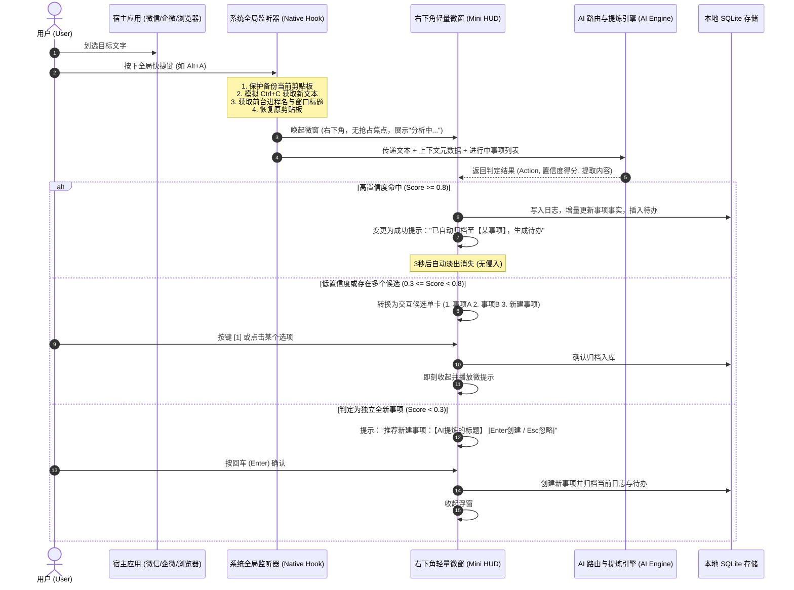
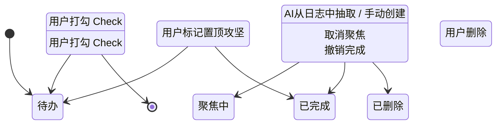
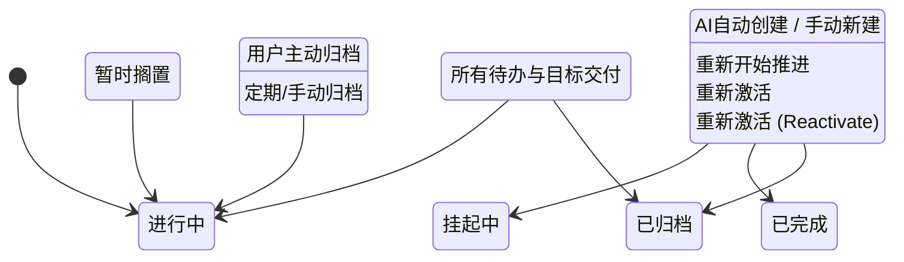

# AI2Assistant 信息架构与交互设计说明书 V0.1

| 版本 | 编写日期 | 状态 | 适用范围 |
| :--- | :--- | :--- | :--- |
| V0.1 | 2026-09-20 | 评审通过 | 交互原型开发、前端UI实现 |

---

## 一、 总体信息架构 (Information Architecture)

AI2Assistant 的整体信息架构设计以**“最小侵入、最高效率、无感沉淀”**为核心，将系统拆解为**全局系统层（常驻托盘与HUD微窗）**与**主应用看板层**两大部分：

```
AI2Assistant 信息架构树
├── 1. 全局系统交互层 (System Background & HUD Layer)
│   ├── 1.1 系统托盘 (System Tray)
│   │   ├── 打开主面板 (Show Main Window)
│   │   ├── 快速进入待办模式 (Quick Focus Todo)
│   │   ├── 开机自启 / 暂停快捷键监听
│   │   └── 退出应用 (Quit)
│   ├── 1.2 全局热键监听器 (Global Shortcut Handler)
│   │   ├── 划选捕获快捷键 (默认 Alt + A)
│   │   └── 快速呼出主面板快捷键 (默认 Alt + Shift + Space)
│   └── 1.3 极简桌面悬浮 HUD / 轻量确认小窗 (Mini HUD Window)
│       ├── 状态1：解析中动态微动效 (Parsing Shimmer/Spinner)
│       ├── 状态2：高置信度归档自动消失 Toast (3s Auto-dismiss)
│       ├── 状态3：多意图/低置信度轻交互选择卡 (1/2/3 键盘单键确认)
│       └── 状态4：新事项推荐与快捷命名 (Enter 确认, Esc 忽略)
│
└── 2. 主应用工作台 (Main Application Window)
    ├── 2.1 顶部全局工具栏 (Top Header Bar)
    │   ├── 事项/待办双视图 Tab 切换
    │   ├── 全局快速搜索框 (按标题/摘要/日志全文检索)
    │   ├── 快速新建事项按钮 (+ New Matter)
    │   └── 设置中心入口 (Settings)
    │
    ├── 2.2 事项看板视图 (Matters Board View - 核心主视图)
    │   ├── 状态过滤器：全部 / 进行中 (默认) / 挂起 / 已完成 / 已归档
    │   ├── 类别过滤器：全部 / 工作 / 生活
    │   ├── 排序选择器：最近更新 (默认) / 优先级 / 重要程度 / 创建时间
    │   └── 事项卡片流 (Matter Cards Grid)
    │       ├── 置顶标识 (Pin Icon)
    │       ├── 事项标题与类别标签
    │       ├── 优先级/紧急度指示条 (色标区分)
    │       ├── 核心事实摘要预览 (折叠显示前2行)
    │       ├── 最新一条时间轴日志摘要与时间
    │       ├── 待办项进度气泡 (如 2/5 已完成)
    │       └── 快捷操作：归档、挂起、完成、展开详情
    │
    ├── 2.3 事项详情与时间轴抽屉 (Detail & Timeline Drawer - 点击卡片滑出)
    │   ├── 抽屉头部：事项标题、状态流转下拉菜单、编辑/归档/删除
    │   ├── 事实摘要沉淀区 (Fact Summary Card)：支持 AI 增量更新与手动修润
    │   ├── 事项待办清单区 (Matter Todo List)：待办新增、勾选完成、提醒时间调整
    │   └── 归集日志 (Log Timeline Stream)
    │       ├── 快速追加新日志输入框 (支持快捷发送)
    │       └── 倒序日志卡片：捕获时间、来源应用/群聊标题、抓取原文、日志转待办入口
    │
    ├── 2.4 全局待办聚合看板 (Todo Master View)
    │   ├── 待办时间切片：已逾期 (Overdue) / 今天 (Today) / 近期 (Upcoming) / 待定 (Someday)
    │   ├── 待办项目卡片：Check 勾选框、待办文本、所属事项超链接、提醒闹钟时间
    │   └── 聚焦模式 (Focus List)：置顶当前正在攻坚的 1~3 个核心待办
    │
    └── 2.5 系统偏好设置 (Settings Modal)
        ├── AI 模型接口配置 (API Host, API Key, Model Provider, Temperature)
        ├── 快捷键自定义与冲突检测
        ├── 自动化行为开关 (自动归档阈值设置、音效提醒开关、开机启动)
        └── 本地数据管理 (SQLite 数据库导出、重置、存储路径)
```

---

## 二、 交互状态机与核心业务流转

### 2.1 划选捕获与意图路由交互泳道图 (Swimlane Sequence)



### 2.2 待办状态机 (Todo State Machine)



### 2.3 事项状态机 (Matter State Machine)



---

## 三、 “轻量级、非阻断式”交互设计规范

为了坚决杜绝干扰用户当前工作心流（如打字、写代码、商务谈判），必须恪守以下 4 条交互铁律：

1. **绝对不抢占输入焦点 (No Focus Stealing)**：
   - 触发快捷键后，唤起的右下角悬浮 HUD 窗口使用 Windows API `WS_EX_NOACTIVATE` 属性或 Electron/Tauri 对应参数，鼠标和键盘的光标仍停留在用户原先正在输入的聊天框或编辑器中。
2. **渐进式侵入原则 (Progressive Intrusion)**：
   - 如果 AI 判断 100% 确定，用户完全无需进行任何二次点击，浮窗以半透明轻盈气泡展现，3 秒后透明度渐变为 0 自动销毁；
   - 仅在遇到歧义时，气泡才扩展为待选择态；
   - 如果用户完全不理睬待选择态，15 秒后自动沉底收纳到“待确认收集箱”，绝不强行阻断屏幕中央。
3. **极速键盘单手盲操 (Single-key Blind Navigation)**：
   - 在选择浮窗激活时：
     - 按数字键 `1` / `2` 直接选中对应候选事项并关闭；
     - 按 `Enter` 回车键采纳推荐的新事项；
     - 按 `Esc` 键直接忽略并关闭；
     - 全程无需伸手拿鼠标。
4. **剪贴板静默透明 (Silent Clipboard Round-trip)**：
   - 整个捕获过程在 100ms 内完成剪贴板快照、虚拟复制、提取、旧剪贴板内容还原，用户原先复制的代码或文字完全不被覆盖。

---

## 四、 核心界面线框原型 (ASCII Wireframes)

### 4.1 桌面右下角轻量确认微窗 (Mini HUD Floating Window)

#### [形态 A：高置信度/解析中]
```
+-------------------------------------------------------+
|  AI2Assistant                                   [x]   |
+-------------------------------------------------------+
|  [⚡ AI 意图识别]                                     |
|  ✓ 已归档至事项: 【A银行项目技术架构交付】            |
|  ✓ 自动提炼待办: "补全白皮书性能指标" (周三 10:00)     |
|                                                       |
|  [ 来源: 企业微信 - A银行对接群 ]        [ 3s 自动关闭 ] |
+-------------------------------------------------------+
```

#### [形态 B：多意图/低置信度选择卡]
```
+-------------------------------------------------------+
|  AI2Assistant · 意图确认                        [x]   |
+-------------------------------------------------------+
|  捕获文本: "张总说下周三前必须提交测试报告..."        |
|  请确认该碎片信息归属的事项:                          |
|                                                       |
|  [1] 【A银行项目交付】 (匹配度 78%)                   |
|  [2] 【Q3研发效能评估】 (匹配度 65%)                  |
|  [3] + 新建事项: "A银行测试报告提交"                  |
|                                                       |
|  提示: 按键盘数字键 [1~3] 快速确认, [Esc] 存入收集箱   |
+-------------------------------------------------------+
```

---

### 4.2 主窗口：事项列表卡片看板 (Main Matters Board)

```
+-----------------------------------------------------------------------------------------------+
|  AI2Assistant 智能助手         [ 事项看板 ]  [ 待办视图 ]              [ 🔍 搜索事项/日志/待办 ] [⚙️]  |
+-----------------------------------------------------------------------------------------------+
|  筛选: [全部状态 v] [工作 v]  | 排序: [最近更新降序 v]               | [+ 新建事项 (Ctrl+N)]          |
+-----------------------------------------------------------------------------------------------+
| +------------------------------------+  +------------------------------------+  +-----------+ |
| | 📌 【A银行系统技术架构白皮书】     |  | 【智能硬件产线巡检方案】           |  | ...       | |
| | 类别: 工作 | 优先级: 高 | 进行中   |  | 类别: 工作 | 优先级: 中 | 进行中   |  |           | |
| |------------------------------------|  |------------------------------------|  |           | |
| | 核心事实摘要:                      |  | 核心事实摘要:                      |  |           | |
| | - 客户要求下周三10点前提交终版     |  | - 硬件打样第一期已通过环境测试     |  |           | |
| | - 重点需补齐性能测试基准与指标     |  | - 待供应链提供二期传感器报价       |  |           | |
| |------------------------------------|  |------------------------------------|  |           | |
| | 🕒 最新日志 (10分钟前):             |  | 🕒 最新日志 (昨天 16:30):          |  |           | |
| | "微信: 张经理说周三上午必须看..."  |  | "企微: 传感器供应商报价已发送至..."|  |           | |
| |------------------------------------|  |------------------------------------|  |           | |
| | 待办: 3项未完成 (最近: 周三 10:00) |  | 待办: 1项未完成                    |  |           | |
| | [ 归档 ] [ 挂起 ]    [ 展开时间轴 >] |  | [ 归档 ] [ 挂起 ]    [ 展开时间轴 >] |  |           | |
| +------------------------------------+  +------------------------------------+  +-----------+ |
|                                                                                               |
| +------------------------------------+  +------------------------------------+                |
| | 【家庭宽带升兆与智能家居升级】     |  | 【2026年技术大会分享筹备】         |                |
| | 类别: 生活 | 优先级: 低 | 进行中   |  | 类别: 工作 | 优先级: 高 | 进行中   |                |
| | ...                                |  | ...                                |                |
| +------------------------------------+  +------------------------------------+                |
+-----------------------------------------------------------------------------------------------+
```

---

### 4.3 事项详情与时间轴抽屉 (Detail & Timeline Drawer)

```
+-----------------------------------------------------------------------------------------------+
|  AI2Assistant 智能助手                                                  [ < 返回看板 ]        |
+-----------------------------------------------------------------------------------------------+
|  事项看板 (灰色背景沉底)              |  👉 【A银行系统技术架构白皮书】                       |
|                                       |  状态: [ 进行中 v ]   优先级: [ 高 v ]  [ 📌 置顶 ]   |
|                                       |  ---------------------------------------------------  |
|                                       |  【核心事实沉淀】                    [ 🤖 重新提炼 ]  |
|                                       |  • 商务约束: 合同已签署，本周交付第一阶段架构设计    |
|                                       |  • 技术指标: TPS 必须大于 5000，延迟低于 50ms         |
|                                       |  • 关键对接人: 客户侧张总，架构师李工                 |
|                                       |  ---------------------------------------------------  |
|                                       |  【关联待办清单】 (2/3已完成)       [ + 添加待办 ]   |
|                                       |  [✓] 完成白皮书技术章节目录搭建                       |
|                                       |  [ ] 补齐性能指标基准压测数据 (⏰ 09-23 10:00)  [聚焦]|
|                                       |  [ ] 邮件发送正式审定版给张经理 (⏰ 09-23 17:00)       |
|                                       |  ---------------------------------------------------  |
|                                       |  【碎片日志时间轴】 (共 5 条)        [ + 手动记录 ]   |
|                                       |                                                       |
|                                       |  ○ 今天 23:10  来自: 企业微信 - A银行项目对接群       |
|                                       |    "张总，关于A银行项目，我们下周三上午10点前需要提交  |
|                                       |     技术架构白皮书终版，请把性能指标章节补全。"       |
|                                       |    [ 转为待办 ] [ 复制原文 ]                          |
|                                       |                                                       |
|                                       |  ○ 09-19 14:20 来自: 个人微信 - 李工                  |
|                                       |    "测试环境的基准压测结果已经出来了，TPS达到5200"   |
|                                       |    [ 转为待办 ] [ 复制原文 ]                          |
+-----------------------------------------------------------------------------------------------+
```

---

### 4.4 待办全景看板 (Master Todo View)

```
+-----------------------------------------------------------------------------------------------+
|  AI2Assistant 智能助手         [ 事项看板 ]  [ 待办视图 ]              [ 🔍 搜索待办 ]    [⚙️]  |
+-----------------------------------------------------------------------------------------------+
|  [⚡ 今日聚焦 Focus (1)]                                                                       |
|  [ ] 补齐性能指标基准压测数据                                                                 |
|      所属事项: 【A银行系统技术架构白皮书】 | 截止时间: 09-23 10:00 (明天上午) | [取消聚焦]     |
|                                                                                               |
|  -------------------------------------------------------------------------------------------  |
|  [🔥 今日到期 Today (2)]                                                                      |
|  [ ] 确认周五述职 PPT 提纲           所属事项: 【Q3季度总结】          | 提醒: 今天 18:00     |
|  [✓] 回复房东关于续签合同的信息       所属事项: 【房屋续租】            | 已完成               |
|                                                                                               |
|  -------------------------------------------------------------------------------------------  |
|  [📅 未来近期 Upcoming (4)]                                                                   |
|  [ ] 提交技术架构白皮书审定版        所属事项: 【A银行系统架构交付】   | 提醒: 09-23 17:00    |
|  [ ] 参加智能硬件线上技术答辩        所属事项: 【智能硬件产线巡检方案】| 提醒: 09-25 14:00    |
+-----------------------------------------------------------------------------------------------+
```
