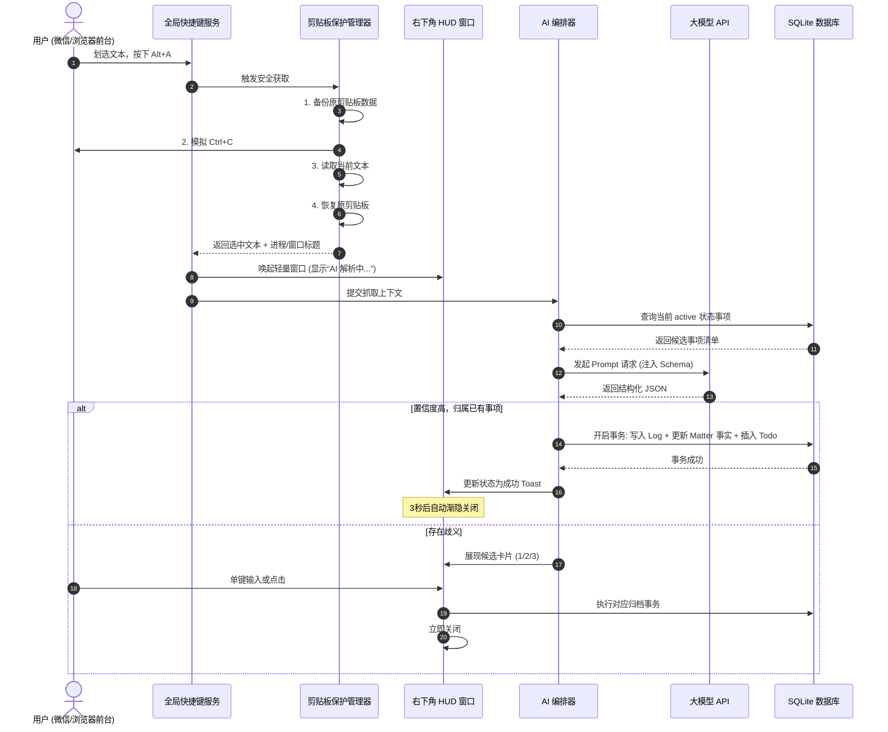

# AI2Assistant 系统架构及概要设计说明书 V0.1

| 版本 | 编写日期 | 状态 | 适用阶段 |
| :--- | :--- | :--- | :--- |
| V0.1 | 2026-09-20 | 架构评审通过 | 研发工程落地与详细设计 |

---

## 一、 技术选型分析与架构决策

### 1.1 桌面端技术栈选型权衡

作为一款需要**常驻系统后台**、**毫秒级响应全局快捷键**、且需要调用**系统级底层 API（剪贴板保护、前台活动窗口探测、模拟击键）**的桌面助手，核心选型对比：

| 评估维度 | 方案 A：Tauri 2.0 (Rust + Web前端) | 方案 B：Electron (Node.js + Chromium) | 选型结论 |
| :--- | :--- | :--- | :--- |
| **内存占用** | 极低（约 30MB ~ 60MB） | 偏高（约 150MB ~ 300MB） | **Tauri 胜出**（常驻后台不影响工作机性能） |
| **安装包体积** | 约 10MB ~ 20MB | 约 80MB ~ 120MB | **Tauri 胜出**（极轻量） |
| **系统底层掌控力** | Rust 语言直接无缝调用 Win32 API，安全高效 | 需借助 node-addon / ffi-napi，依赖较重 | **Tauri 胜出** |
| **生态与成熟度** | 2.0 正式版生态快速完善，跨平台稳定 | 极度成熟，社区轮子丰富 | Electron 生态丰富，但 Tauri 2.0 已完全满足所有需求 |
| **前端灵活性** | 支持任意主流前端框架 (React/Vue/Svelte) | 支持任意主流前端框架 | 平手 |

> **架构决策**：首选建议采用 **Tauri 2.0 (Rust 后端) + React 18 / Vue 3 + Tailwind CSS + SQLite**。如果团队当前 Rust 人才储备有限，亦可采用 **Electron + Node.js + better-sqlite3** 作为对等架构落地，两者在业务架构与分层设计上完全保持一致。以下以通用分层与 Tauri 最佳实践为例进行架构设计。

---

## 二、 系统整体分层架构 (System Architecture)

系统划分为五大层次：**宿主操作系统交互层**、**Native 核心服务层**、**AI 任务编排与调度层**、**数据持久层** 以及 **UI 呈现层**。

```mermaid
flowchart TB
    subgraph OS_Layer ["宿主操作系统 (Windows 10/11)"]
        Win32[Win32 API / UIAutomation]
        GlobalKey[全局键盘事件 (rdev / RegisterHotKey)]
        Clipboard[Windows 剪贴板 API]
        Notification[系统原生 Toast 通知]
    end

    subgraph Native_Core ["Native 核心与系统服务层 (Rust / Tauri Backend)"]
        HotKeyManager[快捷键监听管理器]
        ClipGuard[剪贴板快照与安全还原引擎]
        WindowInspector[前台应用与窗口探测器]
        TrayManager[系统托盘常驻服务]
        ReminderScheduler[待办定时提醒调度器]
        IPCBridge[Tauri IPC 命令路由桥梁]
    end

    subgraph AI_Engine ["AI 智能编排与提炼引擎 (AI Orchestrator)"]
        PromptBuilder[动态 Context & Prompt 组装器]
        LLMClient[OpenAI 兼容协议客户端 (流式/JSON模式)]
        JsonSchemaValidator[结构化输出校验与修复器]
        FallbackEngine[降级策略与收集箱缓冲]
    end

    subgraph Data_Layer ["本地持久化数据层 (SQLite 3)"]
        DBEngine[(SQLite 数据库引擎)]
        MatterRepo[事项仓储 (Matter Repo)]
        LogRepo[日志仓储 (Log Repo)]
        TodoRepo[待办仓储 (Todo Repo)]
        ConfigRepo[偏好配置仓储 (Config Repo)]
    end

    subgraph UI_Layer ["前端展示层 (React/Vue + Tailwind)"]
        HUDWindow["极简悬浮微窗 (HUD Mini Window)"]
        MainWindow["主工作台 (Main Kanban & Drawer)"]
        TodoBoard["待办全局看板 (Focus View)"]
        SettingsModal["设置中心 (Settings)"]
    end

    %% 交互连线
    GlobalKey --> HotKeyManager
    HotKeyManager --> ClipGuard
    ClipGuard <--> Clipboard
    HotKeyManager --> WindowInspector
    WindowInspector --> Win32
    
    ClipGuard --> IPCBridge
    IPCBridge --> HUDWindow
    HUDWindow --> AI_Engine
    AI_Engine --> LLMClient
    
    AI_Engine --> MatterRepo
    AI_Engine --> LogRepo
    AI_Engine --> TodoRepo
    
    MatterRepo --> DBEngine
    LogRepo --> DBEngine
    TodoRepo --> DBEngine
    ConfigRepo --> DBEngine

    ReminderScheduler --> DBEngine
    ReminderScheduler --> Notification

    MainWindow <--> IPCBridge
    TodoBoard <--> IPCBridge
```

---

## 三、 核心模块关键机制详细设计

### 3.1 划选捕获与剪贴板安全还原机制 (Clipboard Safe-Capture)

用户触发全局快捷键（如 `Alt + A`）后，系统必须在 **100ms** 内静默提取选中文本，且绝对不能破坏用户的既有剪贴板内容。

#### 执行时序与算法逻辑：
1. **备份剪贴板**：调用 `OpenClipboard`，读取并保存当前剪贴板的格式与数据快照（支持纯文本/HTML/图片引用等格式）；
2. **模拟键盘复制**：调用 `SendInput` 发送虚拟按键 `Ctrl + C`（需先释放当前快捷键按住的按键修饰符，避免按键冲突）；
3. **等待剪贴板变化**：轮询或监听系统剪贴板更新，超时阈值设为 120ms；
4. **获取选中文本**：提取刚复制进来的纯文本内容，校验文本长度有效性；
5. **探测活动窗口**：调用 `GetForegroundWindow` -> `GetWindowText`（窗口标题）及 `GetWindowThreadProcessId` -> `QueryFullProcessImageName`（进程名称）；
6. **异步恢复剪贴板**：在新线程/协程中将第 1 步备份的原剪贴板数据写回，整个过程用户无感知；
7. **推送至 AI 引擎**：打包 Payload `{ text, sourceApp, windowTitle, timestamp }`。

---

### 3.2 AI 智能语义路由与结构化输出协议 (AI Prompt & JSON Schema)

#### Prompt 设计策略：
为了保证响应速度和准确率，只将用户**当前处于“进行中 (Active)”的最近 10~20 个核心事项**作为 Context 注入 Prompt 中。

```json
{
  "system_prompt": "你是一个高度严谨的桌面智能工作助手。你的任务是将用户划选的一段碎片信息进行语义解析，与现有的【进行中事项】比对，提取出关键事实与待办，并严格以 JSON 格式输出。",
  "user_context": {
    "current_time": "2026-09-20 23:15:00 (Sunday)",
    "active_matters": [
      {
        "id": "matter_001",
        "title": "A银行系统技术架构白皮书",
        "summary": "客户要求下周三提交终版，需补齐性能测试基准"
      },
      {
        "id": "matter_002",
        "title": "智能硬件产线巡检方案",
        "summary": "硬件打样通过，等待供应链二期报价"
      }
    ],
    "input_snippet": {
      "text": "张总，关于A银行项目，我们下周三上午10点前需要提交技术架构白皮书终版，请把性能指标章节补全。",
      "source_app": "企业微信",
      "window_title": "A银行项目交付攻坚群"
    }
  }
}
```

#### 输出数据协议 (JSON Schema)：
```json
{
  "$schema": "http://json-schema.org/draft-07/schema#",
  "type": "object",
  "properties": {
    "action": {
      "type": "string",
      "enum": ["MATCH_EXISTING", "CREATE_NEW", "AMBIGUOUS", "IGNORE"],
      "description": "MATCH_EXISTING: 匹配已有事项; CREATE_NEW: 建议新建; AMBIGUOUS: 存在多项模糊歧义; IGNORE: 噪音信息"
    },
    "matched_matter_id": {
      "type": "string",
      "description": "当 action 为 MATCH_EXISTING 时的目标事项 ID"
    },
    "confidence": {
      "type": "number",
      "minimum": 0.0,
      "maximum": 1.0,
      "description": "置信度评分"
    },
    "suggested_new_matter": {
      "type": "object",
      "properties": {
        "title": { "type": "string" },
        "category": { "type": "string", "enum": ["work", "life"] },
        "priority": { "type": "string", "enum": ["high", "medium", "low"] },
        "summary": { "type": "string" }
      }
    },
    "extracted_facts_delta": {
      "type": "string",
      "description": "从文本中提炼出的客观事实增量（如财务、商务要求、指标）"
    },
    "extracted_todos": {
      "type": "array",
      "items": {
        "type": "object",
        "properties": {
          "content": { "type": "string" },
          "due_time": { 
            "type": "string", 
            "format": "date-time",
            "description": "换算为绝对 ISO 8601 时间戳，若无明确时间则为 null" 
          }
        },
        "required": ["content"]
      }
    }
  },
  "required": ["action", "confidence"]
}
```

---

### 3.3 数据库模型与 DDL 设计 (SQLite 3)

采用轻量级嵌入式 SQLite 数据库，单文件存储于应用数据目录（如 `%APPDATA%/AI2Assistant/data.db`）。

```sql
-- 1. 事项表 (Matters)
CREATE TABLE IF NOT EXISTS matters (
    id TEXT PRIMARY KEY,
    title TEXT NOT NULL,
    overview TEXT DEFAULT '',
    fact_summary TEXT DEFAULT '',
    category TEXT NOT NULL CHECK(category IN ('work', 'life')),
    priority TEXT NOT NULL CHECK(priority IN ('high', 'medium', 'low')) DEFAULT 'medium',
    importance INTEGER DEFAULT 3 CHECK(importance BETWEEN 1 AND 5),
    status TEXT NOT NULL CHECK(status IN ('active', 'pending', 'completed', 'archived')) DEFAULT 'active',
    is_pinned INTEGER NOT NULL DEFAULT 0,
    created_at DATETIME NOT NULL DEFAULT CURRENT_TIMESTAMP,
    updated_at DATETIME NOT NULL DEFAULT CURRENT_TIMESTAMP
);

CREATE INDEX IF NOT EXISTS idx_matters_status ON matters(status);
CREATE INDEX IF NOT EXISTS idx_matters_updated ON matters(updated_at DESC);

-- 2. 碎片日志表 (Logs)
CREATE TABLE IF NOT EXISTS logs (
    id TEXT PRIMARY KEY,
    matter_id TEXT NOT NULL,
    raw_content TEXT NOT NULL,
    source_app TEXT DEFAULT '',
    source_window_title TEXT DEFAULT '',
    created_at DATETIME NOT NULL DEFAULT CURRENT_TIMESTAMP,
    FOREIGN KEY(matter_id) REFERENCES matters(id) ON DELETE CASCADE
);

CREATE INDEX IF NOT EXISTS idx_logs_matter_id ON logs(matter_id);
CREATE INDEX IF NOT EXISTS idx_logs_created ON logs(created_at DESC);

-- 3. 待办项表 (Todos)
CREATE TABLE IF NOT EXISTS todos (
    id TEXT PRIMARY KEY,
    matter_id TEXT NOT NULL,
    log_id TEXT,
    content TEXT NOT NULL,
    due_time DATETIME,
    reminder_time DATETIME,
    is_reminder_sent INTEGER NOT NULL DEFAULT 0,
    status TEXT NOT NULL CHECK(status IN ('pending', 'completed')) DEFAULT 'pending',
    is_focused INTEGER NOT NULL DEFAULT 0,
    created_at DATETIME NOT NULL DEFAULT CURRENT_TIMESTAMP,
    completed_at DATETIME,
    FOREIGN KEY(matter_id) REFERENCES matters(id) ON DELETE CASCADE,
    FOREIGN KEY(log_id) REFERENCES logs(id) ON DELETE SET NULL
);

CREATE INDEX IF NOT EXISTS idx_todos_status ON todos(status);
CREATE INDEX IF NOT EXISTS idx_todos_due ON todos(due_time);
CREATE INDEX IF NOT EXISTS idx_todos_reminder ON todos(reminder_time, is_reminder_sent);

-- 4. 系统设置表 (App Settings)
CREATE TABLE IF NOT EXISTS app_settings (
    key TEXT PRIMARY KEY,
    value TEXT NOT NULL,
    updated_at DATETIME NOT NULL DEFAULT CURRENT_TIMESTAMP
);
```

---

### 3.4 本地待办定时提醒服务 (Local Scheduler)

- 采用本地高效定时器轮询（如每 30 秒查询一次数据库中 `reminder_time <= datetime('now', 'localtime') AND is_reminder_sent = 0` 的记录）；
- 触发系统原生 Windows Toast Notification，附带操作动作：“标记完成”、“稍后提醒（推迟15分钟）”；
- 收到回调后即时更新 SQLite 数据库状态，无需依赖外部云端 Push 服务，离线可用。

---

## 四、 核心业务时序图

### 4.1 划选 -> AI识别 -> 自动归档完整时序


